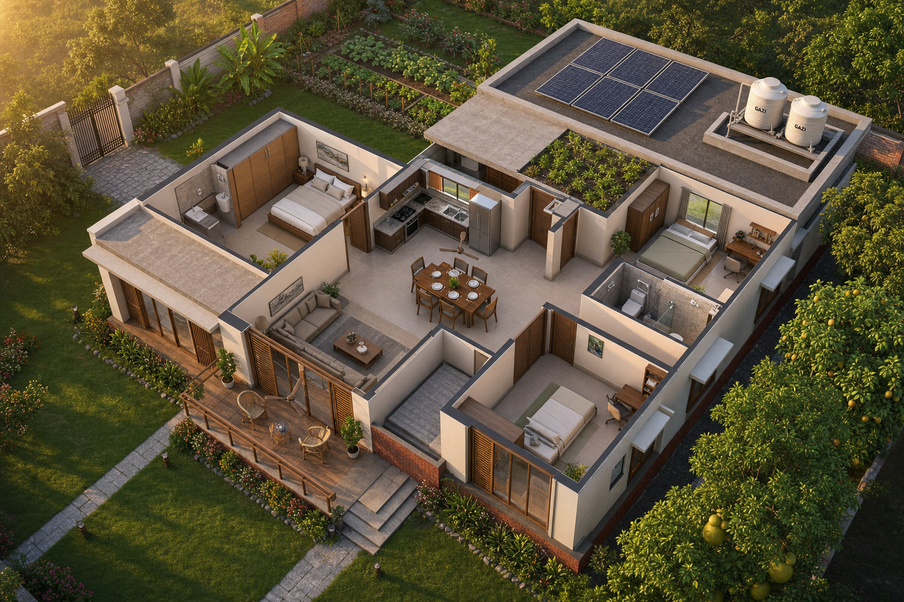

# 🏡 স্বপ্নের বাড়ি — Dream Home Project

> A complete architectural + structural + MEP + finishing design package for a **1,314 sqft modern single-story village home in Bangladesh**, with provision for a future second floor. Designed to be built by local masons (raj mistri) using the Bengali drawings and instructions provided.



---

## ⚡ Quick Stats

| বিষয় | মান |
|---|---|
| **Plot orientation** | Family compound, west-facing main entry |
| **Building footprint** | ৩৬'-৬" × ৩৬'-০" = **১,৩১৪ বর্গফুট** |
| **Floors** | ১ (with structural provision for ২য় floor) |
| **Rooms** | ৩ bedroom, drawing, dining, kitchen, ২ bath, stair, verandah |
| **Verandah** | ১৫'×৬' cantilever, west-facing (main gate side) |
| **Columns** | ১৬ টি (৪×৪ grid), ১২"×১২", M২৫ |
| **Foundation** | Isolated pad footings, ৫'-৬"×৫'-৬"×১'-৩" |
| **Roof** | ৫" RCC flat + ৩.৬' parapet + roof garden + solar + ২×১০০০L tanks |
| **Style** | Modern tropical (BNBC 2020 compliant) |
| **Estimated cost** | **৳ ১.৩০-১.৫০ কোটি** (BD 2026 prices, mid-range) |
| **Construction time** | ~৭ months (210 days) |
| **Total steel** | ৯.১ টন rod |
| **Future Phase-2** | 1st floor addition possible (~১৮ লক্ষ extra) |

---

## 🎯 Start Here

### 👨‍💼 If you're the **Owner / Family member**:
1. Read **[`house-design.md`](house-design.md)** — master index, all decisions, full navigation
2. Look at the 3D renders in **`renders/`** — see how your house will look
3. Review **[`budget/cost-estimate.md`](budget/cost-estimate.md)** — 3 scenarios with savings strategies
4. Review **[`budget/cashflow.md`](budget/cashflow.md)** — month-by-month payment plan
5. Use **[`drawings-bangla/chuktipotro-contract-template.md`](drawings-bangla/chuktipotro-contract-template.md)** for hiring the contractor
6. Print **[`drawings-bangla/safety-emergency-bangla.png`](drawings-bangla/safety-emergency-bangla.png)** for every room

### 👷 If you're the **Raj Mistri / Foreman** (Bengali speaker):
1. Open the **[`drawings-bangla/`](drawings-bangla/)** folder — সব Bengali-তে
2. Start with **[`mobile-quick-ref.md`](drawings-bangla/mobile-quick-ref.md)** — A4 pocket card
3. Read **[`kaaj-nirdeshona.md`](drawings-bangla/kaaj-nirdeshona.md)** — full construction instructions
4. Print all 14 Bengali images at A3 size and laminate for site
5. Follow phase order: foundation → column → beam/slab → walls → plumbing → electrical → finishing

### 👨‍🔧 If you're the **Structural Engineer**:
1. Review **[`drawings/structural-plan.md`](drawings/structural-plan.md)** — column grid, BBS, foundation
2. Review **[`docs/materials-spec.md`](docs/materials-spec.md)** — concrete/steel grades
3. Verify against **[`docs/bnbc-compliance.md`](docs/bnbc-compliance.md)** — BNBC 2020 checklist
4. Cross-check **[`drawings-bangla/bbs-detailed.md`](drawings-bangla/bbs-detailed.md)** — rebar quantities (9.1 tons)
5. Plan **[`docs/phase-2-extension.md`](docs/phase-2-extension.md)** — future floor provisions

### 🏗️ If you're the **Contractor**:
1. Read **[`docs/construction-sequence.md`](docs/construction-sequence.md)** — week-by-week guide
2. Use **[`budget/boq.md`](budget/boq.md)** — Bill of Quantities for pricing
3. Reference **[`budget/vendor-list.md`](budget/vendor-list.md)** — Bangladesh-specific suppliers
4. Sign **[`drawings-bangla/chuktipotro-contract-template.md`](drawings-bangla/chuktipotro-contract-template.md)**
5. Use **[`drawings-bangla/handover-checklist.md`](drawings-bangla/handover-checklist.md)** for final commissioning

---

## 📁 Project Structure

```
dream-home/
├── readme.md                                 ← (you are here) project gateway
├── house-design.md                           ← master index with decisions
│
├── drawings/                  📐 English technical drawings (architect / engineer)
│   ├── floor-plan.md                         room layout + door/window schedule
│   ├── elevations.md                         W/N/E/S elevations + materials
│   ├── structural-plan.md                    columns + beams + foundation
│   ├── site-plan.md                          compound layout + setbacks
│   └── roof-plan.md                          garden + tank + solar
│
├── drawings-bangla/   🇧🇩 31 files | Bengali drawings for raj mistri
│   │   ────────── Phase A: Structural & MEP basics ──────────
│   ├── floor-plan-bangla.png                 তলার নকশা
│   ├── foundation-column-plan-bangla.png     ভিত্তি ও কলাম (১৬টি)
│   ├── beam-slab-plan-bangla.png             বিম ও স্ল্যাব
│   ├── roof-plan-bangla.png                  ছাদের নকশা
│   ├── elevation-west-bangla.png             পশ্চিম দিকের চিত্র
│   ├── section-bangla.png                    ক্রস সেকশন (উচ্চতা)
│   ├── plumbing-plan-bangla.png              পানি + পয়ঃনিষ্কাশন
│   ├── electrical-plan-bangla.png            বিদ্যুৎ লেআউট
│   ├── septic-tubewell-bangla.png            সেপ্টিক + নলকূপ
│   ├── door-window-schedule-bangla.png       দরজা/জানালার তালিকা
│   ├── bbs-reference-bangla.png              রড কাটার নকশা
│   │   ────────── Phase B: Finishing & site works ──────────
│   ├── boundary-wall-gate-bangla.png         বাউন্ডারি wall + ফটক
│   ├── tile-pattern-bangla.png               টাইল প্যাটার্ন
│   ├── kitchen-detail-bangla.png             রান্নাঘরের নকশা
│   ├── wardrobe-detail-bangla.png            ৩টা bedroom wardrobe
│   │   ────────── Phase C: Landscape & post-build ──────────
│   ├── landscape-rainwater-bangla.png        বাগান + বৃষ্টির পানি
│   ├── safety-emergency-bangla.png           নিরাপত্তা পোস্টার (printable)
│   │   ────────── Bengali docs (১৭টি) ──────────
│   ├── kaaj-nirdeshona.md                    কাজের সাধারণ নির্দেশনা
│   ├── mep-specifications.md                 প্লাম্বিং + বিদ্যুৎ specs
│   ├── septic-tubewell-specs.md              সেপ্টিক + নলকূপ specs
│   ├── door-window-schedule.md               দরজা/জানালার full list
│   ├── bbs-detailed.md                       বিস্তারিত BBS (9.1 ton)
│   ├── boundary-wall-gate.md                 wall + gate specs
│   ├── tile-guide.md                         টাইল selection + install
│   ├── kitchen-wardrobe-detail.md            kitchen + wardrobe interior
│   ├── chuktipotro-contract-template.md      বাংলা চুক্তিপত্র
│   ├── landscape-rainwater.md                বাগান + ২.৩L L rainwater/yr
│   ├── emergency-safety.md                   ভূমিকম্প/আগুন/cyclone/first aid
│   ├── maintenance-schedule.md               মাসিক/বার্ষিক/10-yr
│   ├── handover-checklist.md                 commissioning checklist
│   └── mobile-quick-ref.md                   মিস্ত্রির পকেট card (A4)
│
├── budget/               💰 Bill of Quantities + costing
│   ├── boq.md                                line-item Bill of Quantities
│   ├── cost-estimate.md                      3 scenarios (basic/mid/premium)
│   ├── cashflow.md                           7-month payment plan
│   └── vendor-list.md                        Bangladesh supplier directory
│
├── docs/                 📋 Standards & specifications
│   ├── materials-spec.md                     concrete/steel/brick grades
│   ├── bnbc-compliance.md                    BNBC 2020 checklist
│   ├── construction-sequence.md              week-by-week guide
│   └── phase-2-extension.md                  future 2nd floor design
│
├── renders/              🖼️ 3D visualizations
│   ├── exterior/
│   │   ├── west-front-single-story.png       hero shot (day)
│   │   ├── west-front-night.png              night view
│   │   ├── east-back-private-side.png        private east facade
│   │   ├── aerial-single-story-context.png   bird's eye view
│   │   └── isometric-cutaway-house.png       3D cutaway (all rooms)
│   ├── interior/
│   │   ├── interior-drawing-room.png
│   │   ├── interior-master-bedroom.png
│   │   ├── interior-dining.png
│   │   └── interior-kitchen.png
│   ├── site/
│   │   ├── site-plan-illustration.png        compound + pond
│   │   └── roof-garden-sunset.png            roof garden view
│   └── archive/                              previous 2-story design (reference)
│
└── diagram/              📐 User-provided site context
    ├── Home design (1).drawio                family compound layout
    └── *.png                                 floor plan from user
```

---

## 🌟 Design Highlights

### Why this design works for Bangladesh village context

1. **🌞 Climate-responsive tropical design**
   - West verandah with wood-slat screen (sun shade + privacy)
   - Cross-ventilation through opposite windows in every room
   - ৩-foot chajja (eave overhang) on all openings
   - ৩.৬-foot parapet enables future shade structures
   - Light-color exterior (heat reflection)

2. **🏗️ Optimized structural system**
   - ১৬-column 4×4 grid (12'-০" bays — efficient span)
   - Isolated pad footings (cheaper than mat)
   - Phase-2 starter rebar (৪'-০" above slab) for future 2nd floor
   - Future stair opening (8'×5') precast plug
   - BNBC seismic zone-2 compliant

3. **🪟 Western main entry, eastern privacy**
   - Verandah + drawing room face west (compound road / main gate)
   - Bedrooms 2 & 3 face east (pond view, private side)
   - Kitchen on north (cooler, vented away from main entry)
   - Service door (D5) on north for daily kitchen access

4. **🌊 Water-conscious design**
   - 2×1,000L roof tanks (gravity-fed)
   - Deep tube well 300-600' (arsenic-safe layer)
   - ৫,০০০L underground rainwater tank (potential ২.৩৪L liters/year capture)
   - 2-chamber septic (6'×4'×5') + soak pit ৪'⌀×৬'
   - Strict ৩০' tube well ↔ septic distance

5. **⚡ Solar-ready, future-proof**
   - 6×400W panel platform (2.4 kW)
   - Net metering ready
   - Wiring conduit pre-embedded for inverter

6. **🌱 Productive landscape**
   - 6 fruit trees (mango, jackfruit, lemon, guava, pomegranate, plum)
   - Vegetable raised bed
   - Tulsi mancha (east)
   - Compost pit (north)
   - Native flower hedges

---

## 💰 Cost Summary

### Phase-wise budget (Bangladesh 2026 prices)

| Phase | কী | আনুমানিক |
|---|---|---:|
| 🏗️ Structure | Foundation + RCC + walls + plaster | ৭০-৮০ লক্ষ |
| 🔧 Phase A (MEP) | Plumbing + electric + septic + tube well + doors + steel | ১৯-২২ লক্ষ |
| 🎨 Phase B (Finish) | Boundary wall + tiles + kitchen + wardrobe | ৩৩-৪০ লক্ষ |
| 🌿 Phase C (Site) | Landscape + rainwater + safety | ৫-৮ লক্ষ |
| **মোট** | | **৳ ১.৩০-১.৫০ কোটি** |

### Future Phase-2 (when needed)

| Component | Cost |
|---|---:|
| ২য় floor structure + finishing | ~১২ লক্ষ |
| Stair (in existing 8'×5' opening) | ~৩ লক্ষ |
| Phase-2 MEP rough-in | ~৩ লক্ষ |
| **মোট** | **~১৮ লক্ষ** |

> **Notable saving:** Building structure now with starter rebar saves ~৩০% vs. retrofitting later.

### Cashflow (7-month construction)

| Month | Milestone | % |
|:---:|---|---:|
| 1 | Foundation + plinth | 10% → 25% |
| 2-3 | Columns + slab pour | 25% → 50% |
| 4 | Walls + plaster | +15% → 65% |
| 5 | Doors + tiles | +15% → 80% |
| 6 | MEP + finish | +10% → 90% |
| 7 | Paint + handover | +8% → 98% |
| 7+6mo | Retention release | +2% → 100% |

See **[`budget/cashflow.md`](budget/cashflow.md)** for detailed month-by-month plan.

---

## ⚠️ Critical "Don't Forget" Checklist

These 16 things, if missed, cost serious money to fix later:

### 🛑 Before foundation pour
- [ ] Engineer-approved rebar with proper cover (2" footing)
- [ ] Cube samples taken (3 per pour)
- [ ] 40d lap length verified

### 🛑 Before slab pour (CRITICAL)
- [ ] ৬টা PVC sleeve embedded (plumbing - 2 baths + kitchen + vent)
- [ ] Chimney ১০" hole sleeve embedded
- [ ] Ceiling fan electrical conduits (২৫mm PVC)
- [ ] ⚠️ **Phase-2 starter rebar ৪'-০" projection** with anti-rust cover
- [ ] Future stair opening (৮'×৫') precast plug fitted

### 🛑 Before plaster
- [ ] All wall electrical conduits in chase
- [ ] Junction boxes flush
- [ ] PPR water pipes in chase
- [ ] AC copper lines (if applicable)
- [ ] DB box recess

### 🛑 Before tile
- [ ] Pressure test plumbing (0.3 MPa, 30 min)
- [ ] Bathroom waterproofing 2 coat + 24h water test
- [ ] Floor slopes verified

### 🛑 Site water rules
- [ ] **Septic ৩০' minimum from tube well**
- [ ] **Tube well 50' from pond**
- [ ] Bathroom sunken slab 6"
- [ ] DPC at plinth (Dr.Fixit + cement)

### 🛑 Contractual
- [ ] 9 Engineer Hold Points scheduled
- [ ] ২% retention 6 months
- [ ] Cash limit ৫০K (tax compliance)

---

## 🗺️ Project Evolution

This project evolved through several iterations based on site context:

### Original brief (see [Original Brief](#-original-brief-from-readmemd) below)
- 2-story 1,400 sqft modern home
- South-facing veranda
- BNBC compliant, future 3rd floor possible

### Iteration 1: Site context discovered
- Family compound layout (existing homes + internal road + pond)
- New home on **east side of internal road**
- Main gate on west

### Iteration 2: Updated floor plan provided
- User shared 36'×36.5' single-story plan (1,300 sqft)
- 3 bedrooms, drawing/dining, kitchen, 2 baths, stair, verandah
- Plan rotated 90° to align verandah with west main gate

### Iteration 3 (final design)
- ✅ **Single-story** (with future 2nd-floor structural provision)
- ✅ **West-facing main entry** (matches compound circulation)
- ✅ **East private side** (faces existing pond, fruit trees)
- ✅ **North service area** (kitchen back, compost)
- ✅ All structural elements sized for eventual ২য় floor

### Iteration 4: Bengali documentation
- Realized raj mistri need Bengali drawings
- Created `drawings-bangla/` folder with 14 Bengali images + 17 Bengali docs

---

## 📚 Reading Order (recommended)

For first-time review of the entire project:

1. ✅ **[`readme.md`](readme.md)** ← (you are here — overview)
2. ✅ **[`house-design.md`](house-design.md)** ← deep dive index
3. **[`renders/exterior/west-front-single-story.png`](renders/exterior/west-front-single-story.png)** ← visualize main hero
4. **[`renders/exterior/isometric-cutaway-house.png`](renders/exterior/isometric-cutaway-house.png)** ← see rooms in 3D
5. **[`drawings/floor-plan.md`](drawings/floor-plan.md)** ← understand the layout
6. **[`drawings/structural-plan.md`](drawings/structural-plan.md)** ← engineering decisions
7. **[`drawings/site-plan.md`](drawings/site-plan.md)** ← compound context
8. **[`docs/phase-2-extension.md`](docs/phase-2-extension.md)** ← future planning
9. **[`budget/cost-estimate.md`](budget/cost-estimate.md)** ← financial planning
10. **[`drawings-bangla/`](drawings-bangla/)** ← Bengali package for construction team

---

## 🛠️ Quick Start: From Plan to Construction

### Week 0-2: Preparation
- [ ] Engineer approval of structural drawings
- [ ] RAJUK / Union Parishad building approval
- [ ] Soil bearing capacity test
- [ ] Contractor shortlist + interviews
- [ ] Contract signing (use `chuktipotro-contract-template.md`)
- [ ] First payment (10% advance)

### Week 3-4: Site preparation
- [ ] Site marking (plot boundary, building footprint)
- [ ] Temporary water + electric connection
- [ ] Material storage shed
- [ ] First batch of materials (cement, sand, brick soling)
- [ ] Worker accommodation arrangement

### Week 5-12: Foundation + plinth
- [ ] 16 column pit excavation
- [ ] Brick soling + PCC
- [ ] Footing rebar → engineer approval → pour
- [ ] Plinth beam pour
- [ ] Plinth filling + DPC

### Week 13-22: Columns + slab
- [ ] Column rebar (lift 1) → engineer approval → pour
- [ ] Column lift 2 → pour
- [ ] Beam + slab rebar → ⚠️ embed all sleeves → engineer approval
- [ ] **Slab pour day** (all hands on deck)
- [ ] 14-day curing + 28-day prop

### Week 23-30: Walls + plaster + roof finishing
- [ ] Brick masonry (9" external + 5" internal)
- [ ] Lintels precast + install
- [ ] External + internal plaster
- [ ] Roof waterproofing (brick-bat coba + tile)

### Week 31-40: MEP + finishing
- [ ] Plumbing rough-in → pressure test
- [ ] Electrical rough-in → insulation test
- [ ] Door + window installation
- [ ] Tile work (bathrooms first)
- [ ] Kitchen counter + wardrobe install
- [ ] Painting (primer + 2 coat)

### Week 41-42: Commissioning
- [ ] Solar panel + inverter install
- [ ] All systems test (electrical, plumbing, gas)
- [ ] Snag list creation + resolution
- [ ] Final cleaning
- [ ] **Handover** (use `handover-checklist.md`)
- [ ] Pay 98% (retain 2% for 6 months)

---

## 🙏 Acknowledgements & Tools

This project was developed iteratively with:
- **Original brief**: Owner's vision (see below)
- **Site analysis**: User-provided compound diagrams + floor plan
- **Code reference**: Bangladesh National Building Code (BNBC) 2020
- **Material rates**: Bangladesh 2026 market prices (Dhaka + village rates)
- **Renderings**: AI-generated architectural visualizations
- **Bengali documentation**: For local raj mistri usability

---

## 📜 Original Brief (from readme.md)

> The following was the original prompt that started this project. Preserved for reference and project history.

```text
Act as a professional Bangladeshi architect and structural engineer.

Design a modern 2-story residential house for a village location in Bangladesh.

Requirements:

* Plot size: flexible
* Building size: approximately 1400 square feet per floor
* Total floors: 2
* Style: modern tropical architecture suitable for Bangladesh climate
* Large front veranda
* Plenty of natural light and cross ventilation
* Ground floor:
  * 2 bedrooms
  * Large drawing room
  * Dining area
  * Kitchen with store room
  * 2 bathrooms
  * Spacious staircase
* First floor:
  * 2 bedrooms
  * Family living area
  * Prayer room
  * 2 bathrooms
  * Large balcony overlooking the front yard
* Roof:
  * Roof garden space
  * Water tank area
  * Solar panel provision

Important:
* Follow Bangladesh National Building Code (BNBC) concepts.
* Design columns, beams, and stair locations efficiently to reduce construction cost.
* Provide room dimensions in feet.
* Provide a complete floor plan in ASCII format.
* Suggest column grid layout.
* Estimate construction cost for Bangladesh 2026 prices.
* Ensure future extension to a third floor is possible.
* Explain why each room is positioned where it is.
* Create realistic 3D exterior visualization prompts for rendering in Midjourney, Claude, or AI image generators.

Output:
1. Ground floor plan
2. First floor plan
3. Structural column layout
4. Exterior elevation concept
5. Cost estimation
6. 3D render prompts
```

### How the design evolved from this brief

| Original ask | Final delivery | Why changed |
|---|---|---|
| 2-story 1,400 sqft × 2 | Single-story 1,314 sqft (Phase-1) | User provided updated floor plan for single story |
| South-facing veranda | West-facing verandah | Main gate is on west (internal road side) |
| 1st floor balcony | (Phase-2 future) | Single-story now; ২য় floor structural provision exists |
| Prayer room (1st floor) | (Phase-2 future) | Can be added in 2nd floor expansion |
| Family living area (1st floor) | (Phase-2 future) | Same as above |
| 3rd floor possible | 2nd floor possible | Aligned with Phase-2 plan |
| ASCII floor plan | ASCII + image + 3D render | Multiple representations |
| 3D render prompts | Actual 3D renders generated | Skipped the prompt step |
| Cost estimate | BOQ + 3 scenarios + cashflow | Far more detailed |
| Column grid | Full structural drawings + BBS | Engineering-grade output |
| - | **Bengali drawings for mistri** | Added as user realized contractor language need |
| - | **Site context integration** | User provided family compound diagram |
| - | **MEP + landscape + safety + maintenance** | Extended scope for complete home |

---

## 🎯 What's Next

For the project owner:
1. **Engineer approval** (PE-stamped drawings) — required for permit
2. **Local authority permit** (RAJUK / Union Parishad)
3. **Soil test** at site before foundation work
4. **Contractor selection** + contract signing
5. **Material procurement** (use `budget/vendor-list.md`)
6. **Construction starts** — follow week-by-week guide

For ongoing maintenance:
- See **[`drawings-bangla/maintenance-schedule.md`](drawings-bangla/maintenance-schedule.md)** for monthly/yearly checklists
- Print **[`drawings-bangla/safety-emergency-bangla.png`](drawings-bangla/safety-emergency-bangla.png)** in every room
- Set aside **৳ ৩০-৫০K/year** for maintenance reserve

For future Phase-2 (when ready):
- See **[`docs/phase-2-extension.md`](docs/phase-2-extension.md)** — full plan
- Starter rebar protection is critical until then (annual anti-rust check)

---

**🤲 আল্লাহ ভরসা — কাজ শুরু করুন।**

*এই বাড়ি আপনার পরিবারের কয়েক প্রজন্মের আশ্রয় হবে।*
